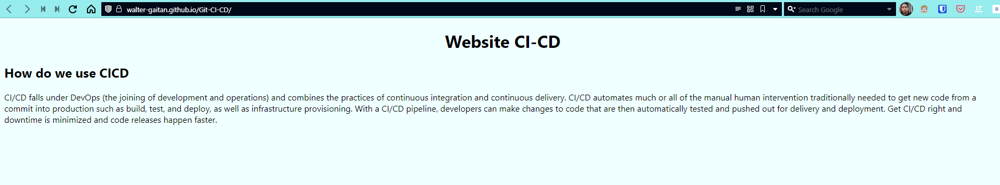

# Git-CI-CD

# week 2 of DevOps Trainee Program

## Introduction

This is a simple web application that will be deployed to a server.

## Steps

1. Create a new repository on Github.
2. Clone the repository.
3. Create a new branch on Github. In this case the branches will be called "develop" and "main".
4. Create a new child branch on Github. In this this case the child branches will be called "release".
5. Create a folder in the repository. This folder will be called "docs" and it will be used by Githup pages to deploy the web application.
6. Create a new file in the "docs" folder. This file will be called "index.html" and it will contain the content of the web application. This file will look like this:

