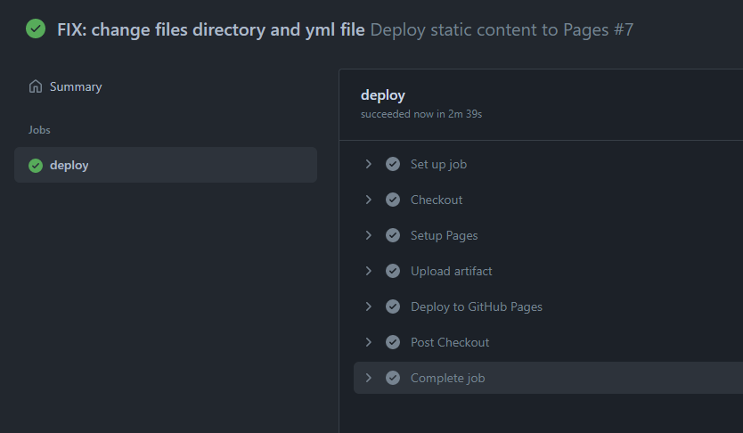

# Git-CI-CD

# week 2 of DevOps Trainee Program

## Introduction

This is a simple web application that will be deployed to a server.

## Steps

1. Create a new repository on Github.
2. Clone the repository.
3. Create a new branch on Github. In this case the branches will be called "develop" and "main".
4. Create a new child branch on Github. In this this case the child branches will be called "release".
5. Jekyll will be used to create the website.
6. The website will be deployed to the server.
7. We will add a theme to the website.
8. Push the changes to Github.
9. Run the workflow. It will deploy the web application to the server.

10. Open the web application in your browser.
